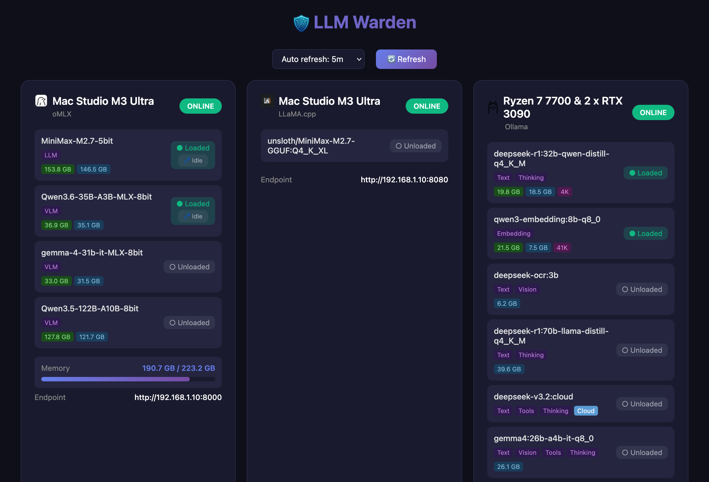

# LLM Warden

Web dashboard for monitoring AI inference servers (oMLX, llama.cpp, Ollama) with a clean, intuitive interface.




---

## ⚙️ Configuration

Edit `config.json`:

```json
{
  "servers": [
    {
      "name": "ollama-local",
      "type": "ollama",
      "base_url": "http://localhost:11434",
      "api_key": ""
    }
  ],
  "refresh_intervals": [2, 5, 10, 30, 60],
  "default_refresh": 10
}
```

### Server Types

| Type | Type Name | Description |
|------|-----------|-------------|
| `ollama` | Ollama | Ollama local/server |
| `llamacpp` | LLaMA.cpp | llama.cpp servers |
| `omlx` | oMLX | oMLX servers |

### Config Fields

- `name` - Server name (shown in subtitle)
- `type` - Adapter type (`ollama`, `llamacpp`, `omlx`)
- `type_name` - Type name displayed on dashboard
- `base_url` - Server endpoint URL
- `api_key` - API key (if required)
- `refresh_intervals` - Available refresh rate options (seconds)
- `default_refresh` - Default refresh rate

---

## 🚀 Getting Started

### Method 1: Manual (Local)

Config and session cache are stored in the project directory.

**1. Create virtual environment**

```bash
python3 -m venv venv
source venv/bin/activate  # Linux/macOS
# venv\Scripts\activate   # Windows
```

**2. Install dependencies**

```bash
pip install -r requirements.txt
```

**3. Configure servers**

```bash
cp config.json.sample config.json
# Edit config.json with your server details
```

**4. Run server**

```bash
python server.py
```

Or with uvicorn directly:

```bash
uvicorn server:app --host 0.0.0.0 --port 8000 --reload
```

**5. Open dashboard**

Visit: **http://localhost:8000**

---

### Method 2: Docker

Config and session cache stored in `/data` (persistent volume).

**1. Configure servers**

```bash
cp config.json.sample config.json
# Edit config.json with your server details
```

**2. Run with docker-compose**

```bash
docker-compose up -d
```

Or with docker run:

```bash
docker build -t llm-warden .
docker run -p 8000:8000 \
  -v $(pwd)/config.json:/data/config.json:ro \
  -v llm-warden:/data \
  llm-warden
```

**3. Open dashboard**

Visit: **http://localhost:8000**

---

## 📡 API Endpoints

| Endpoint | Description |
|----------|-------------|
| `GET /` | Web dashboard |
| `GET /api/status` | Get status of all servers |
| `GET /config` | Get public config info |

---

## 🗂️ Data & Storage

### Manual Mode
- **Config**: `./config.json` (project directory)
- **Session cache**: `~/.cache/llm-warden/omlx_sessions.json`

### Docker Mode
- **Config**: `/data/config.json` (mounted from host)
- **Session cache**: `/data/omlx_sessions.json` (Docker volume)

### Environment Variables

| Variable | Description | Default |
|----------|-------------|---------|
| `CONFIG_DIR` | Override config/cache directory | `./` (manual) or `/data` (docker) |

---

## 🏗️ Project Structure

```
llm-warden/
├── server.py             # FastAPI backend
├── adapters/             # Server adapters
│   ├── base.py
│   ├── llamacpp.py
│   ├── ollama.py
│   └── omlx.py
├── config.json.sample    # Sample config
├── docker-compose.yml    # Docker compose file
├── templates/            # HTML templates
├── static/               # CSS, JS, icons
├── requirements.txt
└── Dockerfile
```

---

## 📝 License

GNU GPL-3.0

---

# LLM Warden (Vietnamese)

Dashboard theo dõi trạng thái các AI inference servers (oMLX, llama.cpp, Ollama) với giao diện web đẹp mắt.

---

## ⚙️ Cấu hình

Chỉnh sửa `config.json`:

```json
{
  "servers": [
    {
      "name": "ollama-local",
      "type": "ollama",
      "base_url": "http://localhost:11434",
      "api_key": ""
    }
  ],
  "refresh_intervals": [2, 5, 10, 30, 60],
  "default_refresh": 10
}
```

### Các loại Server

| Type | Tên Type | Mô tả |
|------|----------|-------|
| `ollama` | Ollama | Ollama local/server |
| `llamacpp` | LLaMA.cpp | llama.cpp servers |
| `omlx` | oMLX | oMLX servers |

### Các trường trong Config

- `name` - Tên server (hiển thị trong subtitle)
- `type` - Loại adapter (`ollama`, `llamacpp`, `omlx`)
- `type_name` - Tên type hiển thị trên dashboard |
- `base_url` - URL endpoint của server |
- `api_key` - API key (nếu cần) |
- `refresh_intervals` - Các tùy chọn refresh rate (giây) |
- `default_refresh` - Refresh rate mặc định |

---

## 🚀 Cách chạy

### Cách 1: Thủ công (Local)

Config và session cache được lưu trong thư mục project.

**1. Tạo virtual environment**

```bash
python3 -m venv venv
source venv/bin/activate  # Linux/macOS
# venv\Scripts\activate   # Windows
```

**2. Cài đặt dependencies**

```bash
pip install -r requirements.txt
```

**3. Cấu hình servers**

```bash
cp config.json.sample config.json
# Chỉnh sửa config.json với thông tin server của bạn
```

**4. Chạy server**

```bash
python server.py
```

Hoặc với uvicorn:

```bash
uvicorn server:app --host 0.0.0.0 --port 8000 --reload
```

**5. Mở dashboard**

Truy cập: **http://localhost:8000**

---

### Cách 2: Docker

Config và session cache được lưu trong `/data` (persistent volume).

**1. Cấu hình servers**

```bash
cp config.json.sample config.json
# Chỉnh sửa config.json với thông tin server của bạn
```

**2. Chạy với docker-compose**

```bash
docker-compose up -d
```

Hoặc với docker run:

```bash
docker build -t llm-warden .
docker run -p 8000:8000 \
  -v llm-warden-data:/data \
  llm-warden
```

**3. Mở dashboard**

Truy cập: **http://localhost:8000**

---

## 📡 API Endpoints

| Endpoint | Mô tả |
|----------|-------|
| `GET /` | Dashboard web |
| `GET /api/status` | Lấy trạng thái tất cả servers |
| `GET /config` | Lấy thông tin config (public) |

---

## 🗂️ Dữ liệu & Lưu trữ

### Chế độ Thủ công
- **Config**: `./config.json` (thư mục project)
- **Session cache**: `~/.cache/llm-warden/omlx_sessions.json`

### Chế độ Docker
- **Config**: `/data/config.json` (Docker volume)
- **Session cache**: `/data/omlx_sessions.json` (Docker volume)

### Biến môi trường

| Biến | Mô tả | Mặc định |
|------|-------|----------|
| `CONFIG_DIR` | Thư mục chứa config/cache | `./` (manual) hoặc `/data` (docker) |

---

## 🏗️ Cấu trúc Project

```
llm-warden/
├── server.py             # FastAPI backend
├── adapters/             # Adapter cho từng loại server
│   ├── base.py
│   ├── llamacpp.py
│   ├── ollama.py
│   └── omlx.py
├── config.json.sample    # Config mẫu
├── docker-compose.yml    # Docker compose file
├── templates/            # HTML templates
├── static/               # CSS, JS, icons
├── requirements.txt
└── Dockerfile
```

---

## 📝 License

GNU GPL-3.0
